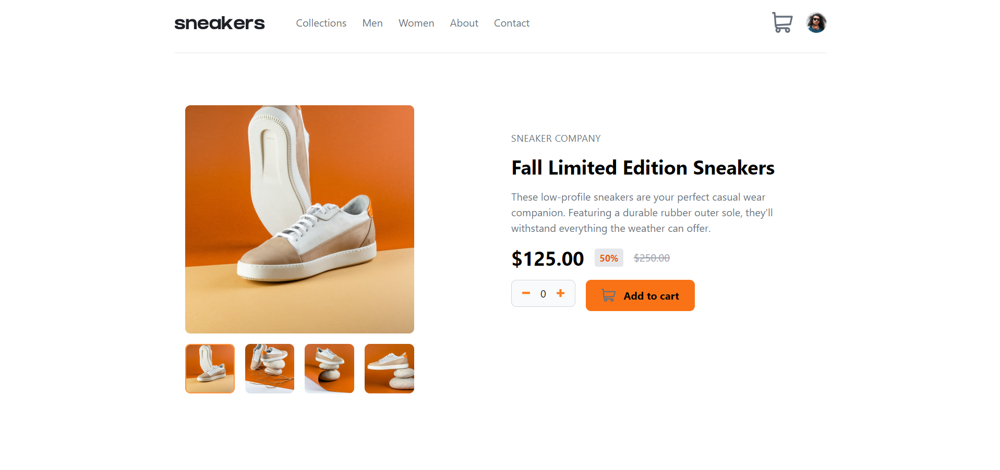
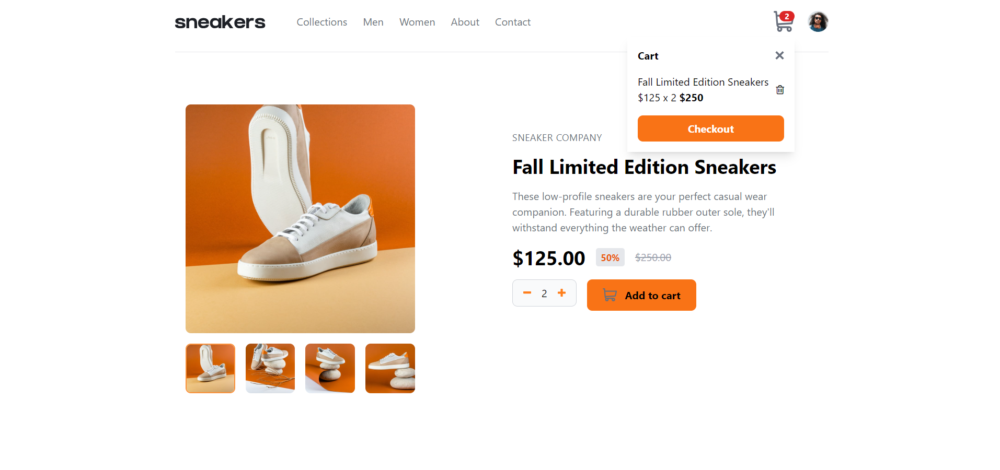

# Frontend Mentor - E-commerce product page solution

This is a solution to the [E-commerce product page challenge on Frontend Mentor](https://www.frontendmentor.io/challenges/ecommerce-product-page-UPsZ9MJp6). Frontend Mentor challenges help you improve your coding skills by building realistic projects.

## Table of contents

- [Overview](#overview)
  - [The challenge](#the-challenge)
  - [Screenshot](#screenshot)
  - [Links](#links)

  - [Built with](#built-with)
  - [What I learned](#what-i-learned)
  - [Continued development](#continued-development)
  

- [Acknowledegments](#Acknowledgements)

## Overview

### The challenge

Users should be able to:

- View the optimal layout for the site depending on their device's screen size
- See hover states for all interactive elements on the page
- Open a lightbox gallery by clicking on the large product image
- Switch the large product image by clicking on the small thumbnail images
- Add items to the cart
- View the cart and remove items from it

### Screenshot

)

### Links

- Solution URL: [Github repository](https://github.com/HubGitShree/FrontEndMentor_E-CommerceProductMainPage)
- Live Site URL: [Sneakers](https://hubgitshree.github.io/FrontEndMentor_E-CommerceProductMainPage/)

### Built with

- Semantic HTML5 markup
- CSS custom properties
- Tailwindcss
- Flexbox
- CSS Grid
- Mobile-first workflow on Tailwindcss
- [Styled Components](https://styled-components.com/) - For styles

### What I learned
- Modal Building using Tailwind Peer utility
- Modal building using javascript
- Advanced DOM Manipulation using classlist and closest

### Continued development

- More practice on DOM Manipulation and positioning in css

## Acknowledgements
- Raja Meenakshi Ma'am for teaching execution of cart elements. It gave me a headstart to implement the cart logic in my site.
- Elan Sir for teaching Tailwindcss utility classes and breakpoints.

